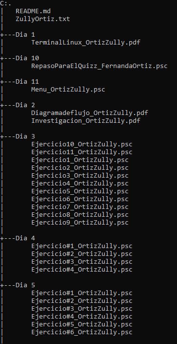
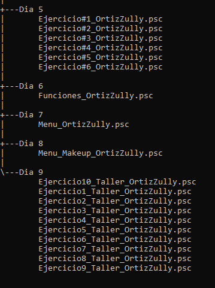

# Introduccion a la programación  

Evidencias de los avances de aprendizaje con el programa pseint y  cmd.

## Descripcióm 

En cada carpeta queda evidenciada temas diferentes donde se evidencia el avance de cada dia.

* Dia 1

|Nombre|Función|
|--|--|
| TerminalLinux_OrtizZully.pdf| Evidencia capturas desde el terminal de cmd.|

* Dia 2

|Nombre|Función|
|--|--|
| Diagramadeflujo_OrtizZully.pdf | Evidencia 11 diagramas desde cero de como hacer cada proceso. |
| Investigación_OrtizZully.pdf | Investigación sobre que son los compiladores e interpretes y leguajes de tipado fuerte y tipado debil. | 

* Dia 3

|Nombre|Función|
|--|--|
| Ejercicio1_OrtiZully.psc | Relizar la suma de dos numeros. |
| Ejercicio2_OrtiZully.psc | Imprimir cual es el numero mayor de tres numeros ingresados por el usuario. |
| Ejercicio3_OrtiZully.psc | Factorial de números. |
| Ejercicio4_OrtiZully.psc | Imprimir si un numero es primo o no. |
| Ejercicio5_OrtiZully.psc | Pasar de grados Celsius a Fahrenheit, solicita una temperatura en grados Celsius y da el resultado en grados Fahrenheit. |
| Ejercicio6_OrtiZully.psc | Imprimir si el número es par o impar. |
| Ejercicio7_OrtiZully.psc | Area de un triangulo. |
| Ejercicio8_OrtiZully.psc | Secuencia Fibonacci. |
| Ejercicio9_OrtiZully.psc | Generar una tabla de multiplicar. |
| Ejercicio10_OrtiZully.psc | Generar promedio de una lista. |
| Ejercicio11_OrtiZully.psc | Area de un circulo. |

* Dia 4

|Nombre|Función|
|--|--|
| Ejercicio#1_OrtiZully.psc | Dia de la semana. |
| Ejercicio#2_OrtiZully.psc | Imprimir si un numero positivo o negativo. |
| Ejercicio#3_OrtiZully.psc | Descuento. |
| Ejercicio#4_OrtiZully.psc | Imprimir si es mayor de edad o no. |

* Dia 5

|Nombre|Función|
|--|--|
| Ejercicio#1_OrtiZully.psc | Imprimir si el estudiante aprobo o desaprobo teniendo encuenta sus notas. |
| Ejercicio#2_OrtiZully.psc | Cuenta desde 1 hasta el 5. |
| Ejercicio#3_OrtiZully.psc | Cuenta desde 1 hasta un número mayor a 100. |
| Ejercicio#4_OrtiZully.psc | Saber los números pares que hay entre 1 y 20. |
| Ejercicio#5_OrtiZully.psc | Saber cuantos días faltan para el fin de semana. |
| Ejercicio#6_OrtiZully.psc | Generar una matriz con números aleatorios. |

* Dia 6

|Nombre|Función|
|--|--|
| Funciones_OrtizZully.psc | Generar cuatro funciones. |

* Dia 7

|Nombre|Función|
|--|--|
| Menu_OrtizZully.psc | Realizar un menu donde el cliente pueda ver, quitar, listar, eliminar e imprimir su compra. |

* Dia 8

|Nombre|Función|
|--|--|
| Menu_Makeup_OrtizZully | Contrución de Menu usando algoritmos CRUD (Create, Read, Update and Delete) |

* Dia 9

|Nombre|Función|
|--|--|
| Ejercicio1_Taller_OrtizZully.psc | Saber el promedio de dos cursos teniendo 4 notas cada curso. |
| Ejercicio2_Taller_OrtizZully.psc | Saber que nota sacar en examen final. |
| Ejercicio3_Taller_OrtizZully.psc | Saber el promedio de edades en un grupo de 4 personas. |
| Ejercicio4_Taller_OrtizZully.psc | Saber la cantidad para llenar una piscina. |
| Ejercicio5_Taller_OrtizZully.psc | Cuantos likometros utilizo un vehiculo. |
| Ejercicio6_Taller_OrtizZully.psc | Cuanto debe pagsr un cliente un alquiler de auto. |
| Ejercicio7_Taller_OrtizZully.psc | Altura de un cono. |
| Ejercicio8_Taller_OrtizZully.psc | Encontrarse dos personas de diferente distancia. |
| Ejercicio9_Taller_OrtizZully.psc | Determinar el tiempo de manejo de dos vehiculos. |
| Ejercicio10_Taller_OrtizZully.psc | Preguntas correctas e equivocadas. |

* Dia 10

|Nombre|Función|
|--|--|
| RepasoParaElQuizz_FernandaOrtiz.psc | Asignacion de cuatro ejercicios diferentes para reforzar nuestros conocimiento para el quiz |

* Dia 11

|Nombre|Función|
|--|--|
| Menu_OrtizZully.psc | Desarrollar un programa en PseInt para gestionar una tienda de celulares. |

## Estructura 

## Instalación y uso

1. Debes tener instalado pseint y git en su ultima version
2. Clonar el directorio.
3. Ejecutar los codigos.

## Lenguajes usados

* Pseint

## Creditos 

Elaborado por Zully Fernanda Ortiz Avendaño Cc. 1092528097 

